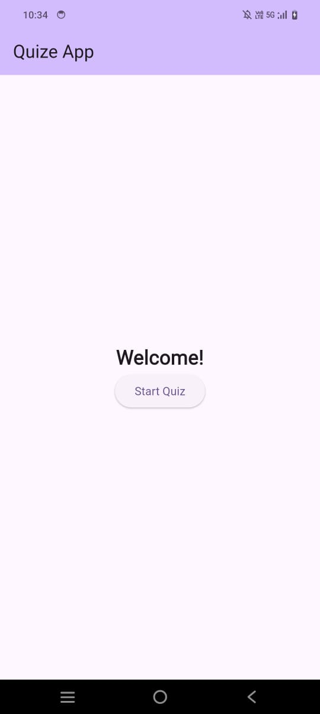

# MyQuizApp

A Flutter project that implements a quiz app. This app features a row of three pictures and a video link.

## Getting Started

This project is a starting point for a Flutter application.

### Prerequisites

Before you begin, ensure you have the following installed:

- Flutter SDK: [Installation Guide](https://flutter.dev/docs/get-started/install)
- Dart SDK (comes with Flutter)
- Android Studio or VS Code (for Flutter development)

### Setup

1. Clone the repository:
   ```bash
   git clone https://github.com/RenderHaven/QuizApp.git

### Preview

<div style="display: flex; justify-content: space-around;">
    
    
    
  </div>

  1. Video Preview:(https://drive.google.com/file/d/1XcoT5Dsj079Y1Xv07Kh1jP73VitGl2YE/view?usp=sharing)
  2. Apk File :(https://drive.google.com/file/d/1axzuxKvxVQWHJSv6x50tYRniHbYieqVe/view?usp=sharing)